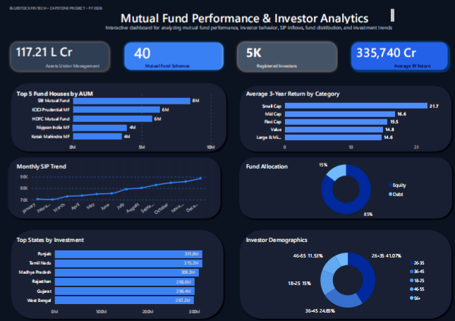

# Mutual Fund Performance Analytics Platform


### Bluestock Fintech Data Analyst Internship Capstone Project

---

# Project Overview

This project was completed as part of the **Bluestock Fintech Data Analyst Internship Capstone Program**.

The objective of this project is to perform an end-to-end analysis of Indian mutual fund performance using historical NAV data and quantitative financial metrics. The workflow includes data cleaning, database creation, SQL analysis, exploratory data analysis (EDA), performance analytics, visualization, and dashboard development.

The project evaluates mutual fund performance through multiple investment metrics such as historical returns, Sharpe Ratio, Sortino Ratio, Alpha, Beta, Maximum Drawdown, and a composite fund scoring model. The final output consists of analytical notebooks, performance scorecards, visualizations, and an interactive Power BI dashboard that supports data-driven investment evaluation.

---

# Project Workflow

```text
Raw Mutual Fund Data
        │
        ▼
Data Cleaning & Validation
        │
        ▼
SQLite Database
        │
        ▼
SQL Analysis
        │
        ▼
Exploratory Data Analysis
        │
        ▼
Performance Analytics
        │
        ▼
Visualization
        │
        ▼
Power BI Dashboard
        │
        ▼
Business Insights
```

---

# Project Objectives

- Clean and preprocess raw mutual fund datasets
- Build a structured SQLite analytical database
- Perform SQL-based exploratory analysis
- Calculate historical return metrics (1-Year, 3-Year, and 5-Year CAGR)
- Evaluate risk-adjusted performance using Sharpe Ratio
- Measure downside risk using Sortino Ratio
- Estimate Alpha and Beta against benchmark indices
- Analyze Maximum Drawdown for downside risk assessment
- Develop a composite scoring model to rank mutual funds
- Visualize investment performance and risk metrics
- Generate business insights and recommendations

---

# Tech Stack

- Python
- Pandas
- NumPy
- Matplotlib
- Seaborn
- Plotly
- Scikit-learn
- SQLite
- SQL
- Jupyter Notebook
- Power BI
- Git
- GitHub

---

# Project Structure

```text
bluestock-mf-capstone/
│
├── analysis/
│   ├── eda.ipynb
│   ├── performance_analytics.ipynb
│   ├── visualization.ipynb
│   ├── figures/
│   └── outputs/
│       ├── alpha_beta.csv
│       ├── cagr_summary.csv
│       ├── fund_scorecard.csv
│       ├── maximum_drawdown.csv
│       ├── sharpe_ratio.csv
│       └── sortino_ratio.csv
│
├── dashboard/
│   ├── Mutual_Fund_Dashboard.pbix
│   └── dashboard_preview.png
│
├── data/
│   ├── raw/
│   └── processed/
│
├── reports/
│   ├── business_insights.md
│   ├── data_cleaning_plan.md
│   ├── data_cleaning_report.md
│   ├── data_dictionary.md
│   ├── data_quality_summary.md
│   └── eda_report.md
│
├── scripts/
│
├── sql/
│
├── .gitignore
├── requirements.txt
├── README.md
└── bluestock_mf.db
```

---

# Datasets

The project uses multiple datasets representing different aspects of the Indian Mutual Fund industry.

| Dataset | Description |
|----------|-------------|
| Fund Master | Mutual fund master information |
| NAV History | Historical NAV prices |
| Scheme Performance | Fund performance metrics |
| Investor Transactions | Investor transaction records |
| Assets Under Management | AUM statistics |
| Monthly SIP Inflows | SIP investment trends |
| Category Inflows | Net inflow by category |
| Industry Folios | Investor folio statistics |
| Portfolio Holdings | Mutual fund holdings |
| Benchmark Indices | Market benchmark performance |

---

# Database Design

SQLite is used as the analytical database for this project.

The database follows a simplified star schema consisting of:

### Dimension Tables

- Fund
- Date

### Fact Tables

- NAV
- Performance
- Transactions

The database structure is optimized to support analytical queries while minimizing data redundancy.

---

# Exploratory Data Analysis

The exploratory analysis focuses on understanding the characteristics of Indian mutual funds and evaluating historical investment performance.

The analysis includes:

- Data quality assessment
- Missing value analysis
- Return distribution analysis
- Fund category analysis
- NAV trend analysis
- Historical performance analysis
- Risk distribution analysis
- Expense ratio analysis
- Investor behavior analysis
- Industry trend exploration

---

# Performance Analytics

A comprehensive performance evaluation framework was developed using historical NAV data.

The analysis includes:

- 1-Year Return
- 3-Year Return
- 5-Year Return
- Sharpe Ratio
- Sortino Ratio
- Alpha
- Beta
- Maximum Drawdown
- Composite Fund Score
- Overall Fund Ranking

These metrics provide a balanced evaluation of return, volatility, downside risk, benchmark performance, and overall investment quality.

---

# Visualization

The visualization notebook presents performance insights through various analytical charts, including:

- Top Performing Funds
- Return Distribution
- Sharpe Ratio Comparison
- Sortino Ratio Comparison
- Alpha vs Beta Scatter Plot
- Maximum Drawdown Comparison
- Overall Fund Ranking
- Correlation Heatmap of Performance Metrics

---

# Dashboard Features

The interactive Power BI dashboard includes:

### KPI Cards

- Total Assets Under Management
- Total Mutual Fund Schemes
- Registered Investors
- Average 3-Year Return

### Analytical Visualizations

- Top Fund Houses by AUM
- Average Return by Category
- Monthly SIP Trend
- Fund Allocation Distribution
- Investment by State
- Investor Demographics
- Top Ranked Mutual Funds
- Risk vs Return Analysis

---

# Dashboard Preview

# Dashboard Preview

Below is the final interactive dashboard developed for this project.



# Key Business Insights

The analysis highlights several important findings:

- Small-cap mutual funds generally generated the highest long-term returns but also exhibited higher downside risk.
- Several large-cap funds consistently achieved superior risk-adjusted performance based on Sharpe and Sortino Ratios.
- Benchmark comparison indicates that only a subset of funds consistently generated positive Alpha.
- Maximum Drawdown analysis reveals significant differences in downside exposure across fund categories.
- Composite scoring identifies a group of mutual funds that successfully balance return potential and investment risk.

---

# Project Outputs

The project delivers the following outputs:

- Cleaned datasets
- SQLite analytical database
- SQL analytical queries
- Data Dictionary
- Data Cleaning Report
- Data Quality Summary
- Exploratory Data Analysis Notebook
- Performance Analytics Notebook
- Visualization Notebook
- Business Insights Report
- Mutual Fund Performance Scorecard
- Power BI Dashboard

---

# How to Run

## 1. Clone Repository

```bash
git clone https://github.com/<your_username>/bluestock-mf-capstone.git
```

---

## 2. Install Dependencies

```bash
pip install -r requirements.txt
```

---

## 3. Run Data Cleaning

```bash
python scripts/cleaning/clean_01_fund_master.py
```

Repeat for the remaining cleaning scripts if needed.

---

## 4. Build SQLite Database

```bash
python scripts/load_to_db.py
```

---

## 5. Execute SQL Analysis

```bash
python scripts/run_query.py
```

---

## 6. Run Exploratory Data Analysis

Open:

```text
analysis/eda.ipynb
```

Run all notebook cells to reproduce the exploratory analysis.

---

## 7. Run Performance Analytics

Open:

```text
analysis/performance_analytics.ipynb
```

This notebook calculates:

- Historical Returns
- Sharpe Ratio
- Sortino Ratio
- Alpha
- Beta
- Maximum Drawdown
- Composite Scorecard

---

## 8. Run Visualization

Open:

```text
analysis/visualization.ipynb
```

This notebook generates analytical charts used for business insights.

---

## 9. Open Power BI Dashboard

Open:

```text
dashboard/Mutual_Fund_Dashboard.pbix
```

using Power BI Desktop.

---

# Future Improvements

Possible future enhancements include:

- Portfolio optimization using Modern Portfolio Theory
- CAPM-based investment analysis
- Monte Carlo portfolio simulation
- Machine learning-based fund recommendation
- Time-series forecasting for NAV prediction
- Automated ETL pipeline
- Real-time dashboard integration
- Power BI Service deployment

---

# Author

**Zalsabilah Rezky Amelia Arep**

Data Analyst Intern

Bluestock Fintech Internship Capstone Project

---

# Acknowledgements

This project was developed as part of the **Bluestock Fintech Data Analyst Internship Capstone Program**, integrating data cleaning, SQL analytics, exploratory data analysis, quantitative performance evaluation, and business intelligence into a complete end-to-end analytics solution.